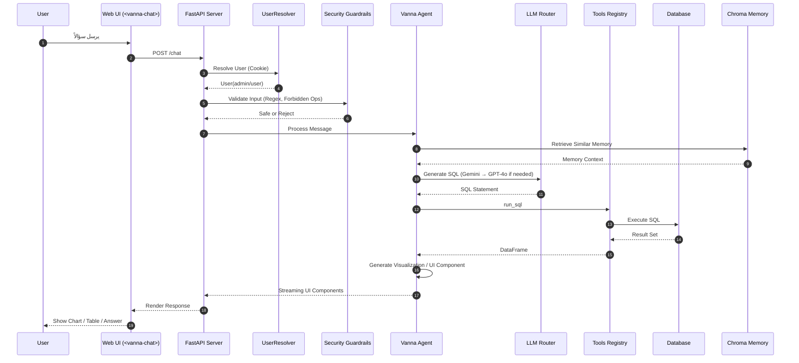
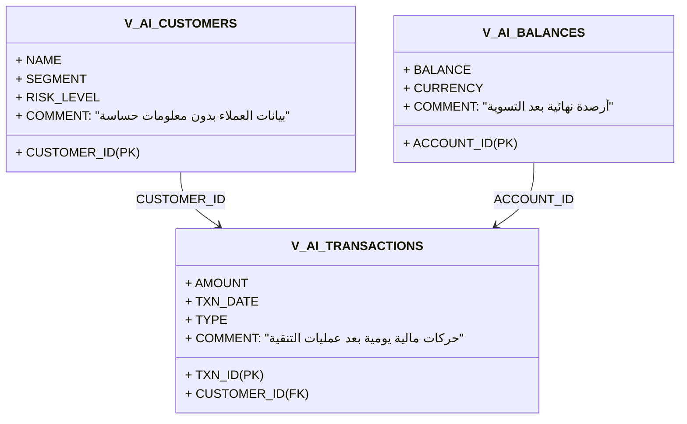

فيما يلي **الـ Blueprint النهائي** لمنصتك وفقاً لكل القرارات الحاسمة التي اعتمدناها، ويشمل:

1. **مخطط معماري كامل (Mermaid Architecture Diagram)**
2. **مخطط تدفّق تشغيل الوكيل (Sequence UML)**
3. **هيكل المشروع الرسمي (Project Structure Blueprint)**
4. **مخطط قواعد البيانات + سكيمة الطبقة الدلالية (Optional)**

هذه الوثيقة يمكن وضعها مباشرة في ملف:
`ARCHITECTURE_BLUEPRINT.md`

---

# 1️⃣ **⚙️ Blueprint النهائي — Mermaid Architecture Diagram**

هذا هو المخطط الرسمي الكامل للبنية (Architecture Diagram) باستخدام Mermaid:

```mermaid
flowchart TB

    %% ===== USERS =====
    User([المستخدم النهائي<br>Analyst / Admin])

    %% ===== FRONTEND =====
    UI[index.html<br><vanna-chat> Web Component]
    AdminUI[Admin Panel<br>(React/Tailwind) - مستقبل]

    %% ===== BACKEND =====
    subgraph API[FastAPI Backend - Vanna 2.0 Agent]
        direction TB
        
        Agent[Vanna Agent<br>LLM Router + Tool Registry]
        UserResolver[SimpleUserResolver<br>Cookie Auth]
        Tools[Tools Registry<br>SQL • Viz • Memory • Training]
        Guardrails[Security Layer<br>Prompt Guard + Regex Filter]
        LogicRouter[LLM Router<br>Gemini → GPT-4o]
        Memory[ChromaDB<br>Vector Store]

        subgraph DB_Abstraction[DB Abstraction Layer]
            SQLiteRunner[(SQLite Runner)]
            OracleRunner[(Oracle Runner)]
        end
    end

    %% ===== DATABASES =====
    subgraph Databases[Data Sources]
        SQLite[(SQLite<br>Dev)]
        Oracle[(Oracle DB<br>Prod)]
        OracleViews[[V_AI_* Views<br>Secure Banking Interface]]
    end
    
    %% ===== OPTIONAL =====
    subgraph OptionalSystems[Optional Future Systems]
        Superset[Apache Superset<br>Docker Compose]
        OpenTelemetry[OpenTelemetry / Grafana]
        Keycloak[Keycloak Auth / LDAP]
        Ollama[Local LLM (Bank Use)]
    end


    %% ===== CONNECTIONS =====
    User --> UI
    AdminUI --> API

    UI -->|REST / SSE / WebSocket| API

    API --> UserResolver
    API --> Guardrails
    Guardrails --> Agent
    Agent --> LogicRouter
    Agent --> Tools
    Agent --> Memory


    Tools --> DB_Abstraction
    DB_Abstraction --> SQLite
    DB_Abstraction --> Oracle
    Oracle --> OracleViews

    Superset -.-> API
    OpenTelemetry -.-> API
    Keycloak -.-> UserResolver
    Ollama -.-> LogicRouter
```

---

# 2️⃣ **📡 Sequence UML — سير عمل الوكيل**

مخطط تسلسلي UML يوضح ما يحدث عند إرسال سؤال:



---

# 3️⃣ **📁 الهيكل الرسمي للمشروع (Project Structure Blueprint)**

هذا الهيكل هو النموذج المعتمد لمشروعك النهائي:

```
project-root/
│
├── app.py                         # FastAPI + Vanna Agent
├── custom_tools.py                # Training Tool + Extensions
├── requirements.txt               # Dependencies
├── .env                           # Source of Truth for config
│
├── data/
│   ├── mydb.db                    # SQLite (Dev)
│   └── scripts/                   # SQL / seed scripts
│
├── chroma_db/                     # Vector Memory Store
│
├── db_connect/
│   ├── oracle_runner.py           # Custom Oracle Runner
│   ├── sqlite_runner.py           # sqlite wrapper (if needed)
│   └── db_resolvers.py            # Environment routing (Dev/Prod)
│
├── security/
│   ├── guardrails.py              # Prompt Guard / Regex filters
│   ├── input_validation.py
│   └── auth_policies.py
│
├── schema/
│   ├── comments_metadata/         # DB comments export (Oracle)
│   ├── curated_views/             # DDL for V_AI_* views
│   └── semantic_index.yaml        # Optional semantic map
│
├── ui/
│   ├── index.html                 # <vanna-chat> interface
│   ├── admin/                     # Future React Admin Panel
│   └── assets/                    # JS/CSS/Logos
│
├── logs/
│   └── app.log                    # JSON-formatted logs
│
├── deployment/
│   ├── systemd.service            # For Prod running
│   ├── docker-compose.yml         # Optional future (Superset)
│   └── Dockerfile                 # Optional
│
└── docs/
    ├── ARCHITECTURE_BLUEPRINT.md
    ├── API_REFERENCE.md
    ├── SECURITY_MODEL.md
    └── DEPLOYMENT_GUIDE.md
```

---

# 4️⃣ **📑 مخطط الطبقة الدلالية (Semantic Layer Blueprint)**

*(مُصمم لبيئة Oracle البنكية)*



---

